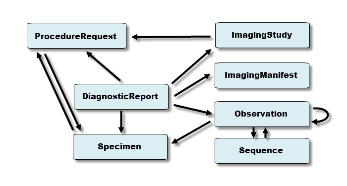
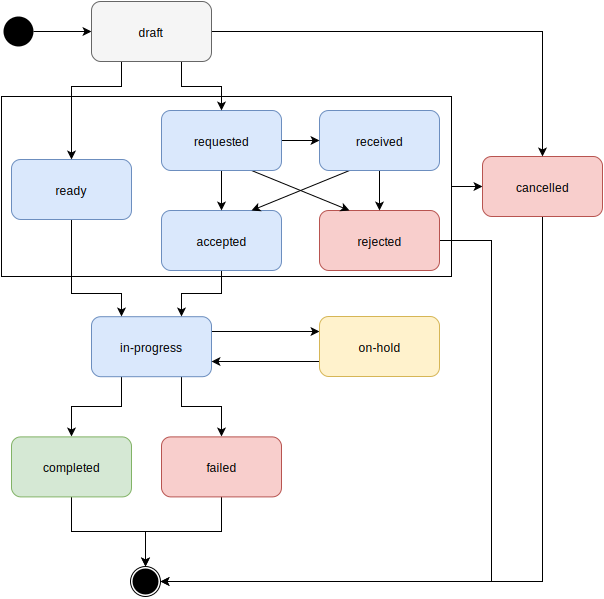

# iSantePlus/OpenELIS Lab Orders Workflow

- [iSantePlus/OpenELIS Lab Orders Workflow](#isanteplusopenelis-lab-orders-workflow)
  - [Work Plan](#work-plan)
  - [Lab Workflow Mapping](#lab-workflow-mapping)
  - [The `Task` resource](#the-task-resource)
  - [The `ProcedureRequest` Resource](#the-procedurerequest-resource)
  - [OpenMRS Lab Order Entry](#openmrs-lab-order-entry)
  - [iSantePlus Lab Order Entry](#isanteplus-lab-order-entry)
  - [Overview of the Workflow:](#overview-of-the-workflow)
  - [Testing and Notes](#testing-and-notes)
## Work Plan
This workflow requires the *OpenMRS FHIR Module* to support, at minimum, the `ProcedureRequest`, `DiagnosticReport`, `Observation`, and `Task` resources. Currently, `ProcedureRequest`, `Observation`, and `DiagnosticReport` are, to some degree, implemented - as is detailed further down this document. 

To ensure the Lab Orders workflow is fully supported, we need to:

1. Identify all of the data types that get generated when an *OpenMRS* lab order (`Order`? `TestOrder`?) gets created.

2. Identify any data types that are required by the *iSantePlus* <--> *OpenELIS* data flow that is currently implemented using HL7 V2 messages. 
   
3. Identify the corresponding attributes for all of required data types in the `Task` and `ProcedureRequest` resources. 
   
4. Test these mappings in the current implementation the *FHIR Module* to identify any gaps / issues that exist.

5. Implement the FHIR `Task` resource in the FHIR module, and ensure OpenMRS can function as a repository for these resources. (This might require modifying the data model...)

6. Trigger the creation of a FHIR `Task` resource with a `ProcedureRequest` attached as a `Task.input.value` when a Lab Order is created in *OpenMRS*. 
   
7. Send a `POST` request to *OpenELIS* with the `Task` resource? (unclear direction)

8. Handle `Task` resource `PUT` requests from `OpenELIS` updating `Task.status`, `Task.statusReason`, `Task.businessStatus`, and `Task.output`. 
   
9. Handle a `completed` status for the `Task` by reading the `DiagnosticReport` attached to `Task.output` and saving it using the *OpenMRS* data model. 

---

## Lab Workflow Mapping

STU3:  
http://hl7.org/fhir/STU3/diagnostics-module.html 

R4:  
http://hl7.org/fhir/diagnostics-module.html

**Example Workflow**  
https://www.hl7.org/fhir/workflow-communications.html#12.6.2.1

**Required Resources**
- `ProcedureRequest`: https://github.com/openmrs/openmrs-module-fhir/blob/master/api/src/main/java/org/openmrs/module/fhir/api/ProcedureRequestService.java
- `DiagnosticReport`: https://github.com/openmrs/openmrs-module-fhir/tree/master/api/src/main/java/org/openmrs/module/fhir/api/diagnosticreport
- `Observation`: https://github.com/openmrs/openmrs-module-fhir/blob/master/api/src/main/java/org/openmrs/module/fhir/api/ObsService.java
- `Specimen`: http://hl7.org/fhir/STU3/specimen.html (no OpenMRS implementation)
- `Sequence`: http://hl7.org/fhir/STU3/sequence.html (no OpenMRS implementation)
- `ImagingStudy`: (no OpenMRS implementation)
- `ImagingManifest`: (no OpenMRS implementation)

Required by Workflow: 
- `Task`: https://www.hl7.org/fhir/task.html (no OpenMRS Implementation)

---

## The `Task` resource 
STU3: https://www.hl7.org/fhir/STU3/task.html  
R4: https://www.hl7.org/fhir/task.html

> "...describes an activity that can be performed and tracks the state of completion of that activity. It is a representation that an activity should be or has been initiated, and eventually, represents the successful or unsuccessful completion of that activity."

In our workflow, the `Task` resource can keep track of the status of the **Lab Order** made in *iSantePlus*. The `Task` resource keeps track of inputs, outputs, and task status. The status represented by a given state in the following state machine: 

**Required Fields**

1. `Task.status` - [Valueset](https://hl7.org/fhir/2018Jan/valueset-task-status.html)
2. `Task.intent` - [Valueset](https://hl7.org/fhir/2018Jan/valueset-request-intent.html)
3. `Task.priority` - [Valueset](https://hl7.org/fhir/2018Jan/valueset-request-priority.html)

**Other Possible Fields**
https://hl7.org/fhir/2018Jan/task.html#tx

1. `Task.statusReason`: (Codable Concept) 
   > Codes to identify the reason for current status. These will typically be specific to a particular workflow.	
2. `Task.businessStatus`: (Codable Concept) 
   > The domain-specific business-contextual sub-state of the task. For example: "Blood drawn", "IV inserted", "Awaiting physician signature", etc.
3. `Task.code`:
   > Codes to identify what the task involves. These will typically be specific to a particular workflow.
4. `Task.performerType`:(Codable Concept) [Valueset](https://hl7.org/fhir/2018Jan/valueset-task-performer-type.html)

**HAPI Task Class**  
https://hapifhir.io/apidocs-dstu3/org/hl7/fhir/dstu3/model/Task.html

---

## The `ProcedureRequest` Resource
STU3:  
http://hl7.org/fhir/STU3/procedurerequest.html
https://hapifhir.io/apidocs-dstu3/org/hl7/fhir/dstu3/model/ProcedureRequest.html

> `ProcedureRequest` is a record of a request for a procedure to be planned, proposed, or performed, as distinguished by the ProcedureRequest.intent field value, with or on a patient. 

> The procedure will lead to either a `Procedure` or `DiagnosticReport`, that in turn may reference one or more `Observations`, that summarizes the performance of the procedures and associated documentation such as observations, images, findings that are relevant to the treatment/management of the subject.

**Examples:** diagnostic tests/studies, endoscopic procedures, counseling, biopsies, therapies (e.g., physio-, social-, psychological-), (exploratory) surgeries or procedures, exercises, and other clinical interventions. 

**OpenMRS FHIR Module Implementation**
- Service: https://github.com/openmrs/openmrs-module-fhir/blob/master/api/src/main/java/org/openmrs/module/fhir/api/ProcedureRequestService.java
- Service Implementation: https://github.com/openmrs/openmrs-module-fhir/blob/master/api/src/main/java/org/openmrs/module/fhir/api/impl/ProcedureRequestServiceImpl.java
- Strategy: https://github.com/openmrs/openmrs-module-fhir/blob/master/api/src/main/java/org/openmrs/module/fhir/api/strategies/procedurerequest/ProcedureRequestStrategy.java
- Utilities: https://github.com/openmrs/openmrs-module-fhir/blob/master/api/src/main/java/org/openmrs/module/fhir/api/util/FHIRProcedureRequestUtil.java

**Mappings**

The OpenMRS `Order` and `TestOrder` objects are used in the [ProcedureRequest Strategy Implementation](https://github.com/openmrs/openmrs-module-fhir/blob/master/api/src/main/java/org/openmrs/module/fhir/api/strategies/procedurerequest/ProcedureRequestStrategy.java)

A `ProcedureRequest` is generated in [this util method](https://github.com/openmrs/openmrs-module-fhir/blob/master/api/src/main/java/org/openmrs/module/fhir/api/util/FHIRProcedureRequestUtil.java#L47) from a `TestOrder` input. 

The mapping from `ProcedureRequest` to `TestOrder` is implemented [here](https://github.com/openmrs/openmrs-module-fhir/blob/master/api/src/main/java/org/openmrs/module/fhir/api/util/FHIRProcedureRequestUtil.java#L71). The mappings use `BaseOpenMRSDataUtil.readBaseExtensionFields` and `BaseOpenMRSDataUtil.setBaseExtensionFields` - methods I have to look into still. 

---

## OpenMRS Lab Order Entry
https://wiki.openmrs.org/display/projects/Order+Entry+End+User+Guide+for+Lab+Orders
https://wiki.openmrs.org/display/docs/Lab+Order+Entry

## iSantePlus Lab Order Entry

## Overview of the Workflow:
1. A lab order is created in *iSantePlus*: 

2. This lab order is mapped to a `ProcedureRequest` FHIR resource:

3. A `Task` resource is created with the and linked to the `ProcedureRequest` resource:
      - `Task.basedOn` --> `ProcedureRequest`
      - `Task.status` --> `draft` 
      - `Task.businessStatus` --> ??
      - `Task.statusReason` --> ??
      - `Task.code` --> ?? (Do we want some information about this task in the Task resource, or all in the ProcedureRequest resource?)

4. Options:
      - *OpenMRS* sends a request to *OpenELIS* with the created `Task` resource?
      - *OpenMRS* notifies *OpenELIS* about the creation of the `Task` resource, which then triggers a request from *OpenELIS* to retrieve the Task resource?

      - `Task.status` --> `recieved` 

5. *OpenELIS* validates the `ProcedureRequest` and either accepts or rejects the `Task`:
      - Send an `PUT` request to OpenMRS:  `Task.status` --> `accepted` | `rejected` ??
      - Notify OpenMRS in some other fashion??

6. *OpenELIS* manages the lab order workflow, and updates the `Task.status` and optionally the `Task.businessStatus` and `Task.statusReason` with additional information about the status Lab order. 

7. When results are avialable, *OpenELIS* creates a `DiagnosticReport` resource with associated `Observations`/other resources. 
      - *OpenELIS* sends a `PUT` request to *OpenMRS* to update the `Task` resource

      - `Task.status` --> `completed`
      - `Task.output.value[1]` --> `DiagnosticReport`

**Workflow Patterns**  
http://hl7.org/fhir/STU3/workflow-communications.html#commpatternslist

**Changes in R4**

- `ProcedureRequest` --> `ServiceRequest`
- No `ImagingManifest` Resource
- `Media` Resource added

https://docs.google.com/document/d/1FEx8KUpxQfRP_TRtvAZvjTSt9BiB-nX4r9Qj-jvn528/edit

## Testing and Notes

Demo Data on the server: 
How do I see the list of patients that get generated in the Database? Are there permissions that need to be set in order for all patients in a system to be visible? 

I had to create the following patient in order to be able to query it using the FHIR Client. 

Test Patient UUID: `d5cd0e30-5c37-4106-bc59-6f17c5a43240`

Test Procedure UUID: 