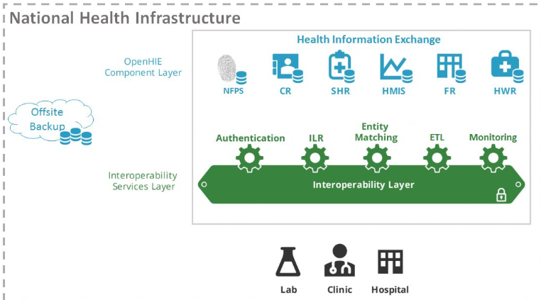
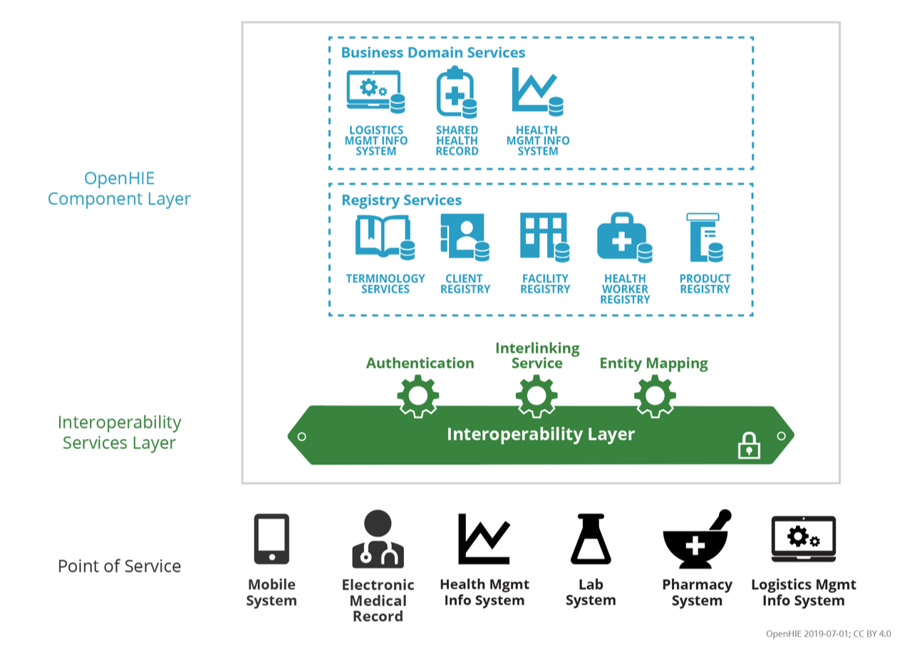

# SEDISH
https://github.com/sedish

## OpenHIE
https://wiki.ohie.org/display/documents/OpenHIE+Introduction        E

### OpenHIE and FHIR
https://wiki.ohie.org/display/resources/2019+OpenHIE+Community+Meeting

> Our new v.2 of the OpenHIE architecture is focused on leveraging
> the emerging HL7 FHIR standard (OpenHIE v.FHIR).
>  
> How will we conformance-test OpenHIE workflows that are expressed using the FHIR standard?
> What will be the impacts of FHIR's architectural behaviour; it behaves differently from the underlying specifications we relied upon for OpenHIE v1? What are some of the ways our architectural patterns might need to evolve?
> Which strategies should we favour as we work to translate "normative" workflow descriptions into automated-testing platforms?
> How can such platforms be leveraged by country partners to conformance-test indigenous digital health solutions in support of national interoperability initiatives?

https://wiki.ohie.org/display/resources/2018+OpenHIE+Community+Meeting
> FHIR Gaps	OHIE Architecture Team (Shaun Grannis / Jennifer Shivers
> 
> OHIE Architecture	What are the FHIR gaps in supporting existing workflows and country needs and how do we fill them in?  / OpenHIE + maturing HL7 FHIR standards

## SHR
- https://wiki.ohie.org/pages/viewpage.action?pageId=19464697
- https://github.com/jembi/openshr

- https://github.com/SEDISH/oshr
- https://github.com/SEDISH/openmrs-module-shr-cdahandler

- https://github.com/jembi/hearth

**SHR Level 1 - (at least one content profile + query for existing data)**

A **phase 1** OpenHIE SHR must implement the following:

- XDS.b's provide and register document, stored query and retrieve document transactions
- At least one of the Patient Care Coordination CDA content profiles which profile the CDA Continuity of Care Document (CCD) specification.
- The Query for Existing Data (QED) profile

**SHR Level 2 - (all PCC content profiles + query for existing data + referrals)**

A **phase 2** OpenHIE SHR must implement the following:

- XDS.b's provide and register document, stored query and retrieve document transactions
- ALL of the Patient Care Coordination CDA content profiles which profile the CDA Continuity of Care Document (CCD) specification.
- The Emergency Department Referral (EDR) PCC profile which supports referrals
- The Query for Existing Data (QED) profile

**SHR Level 3 - (clinical documents + query for existing data + referrals + some form of data export - [perhaps lab and drug profiles])**

A **phase 3** OpenHIE SHR must implement the following:

- XDS.b's provide and register document, stored query and retrieve document transactions
- ALL of the Patient Care Coordination CDA content profiles which profile the CDA Continuity of Care Document (CCD) specification.
- The Emergency Department Referral (EDR) PCC profile which supports referrals
- The Query for Existing Data (QED) profile
- A to-be-determined mechanism to export data for reporting purposes

## MPI / Client Registry
- https://wiki.ohie.org/display/SUB/Client+Registry+Community
- https://github.com/SEDISH/ohie-cr

National Fingerprint Server

OpenEMPI - https://www.openempi.org/support/

## DHIS2
- https://github.com/SEDISH/ohie-fr
- https://wiki.ohie.org/display/SUB/Facility+Registry+Community

## Interoperability Layer

## Entity Matching

## Monitoring

## N

